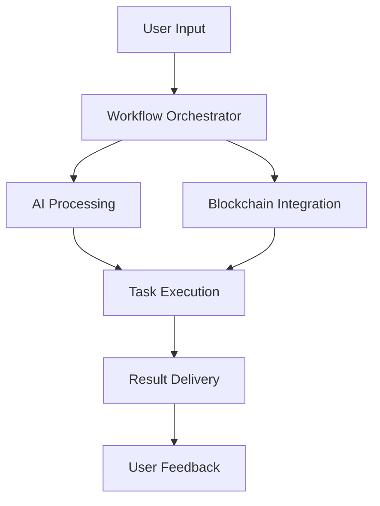

# AgentGPT Workflow Orchestrator

<div align="center">
  
  [](https://badge.fury.io/js/%40agentgpt%2Fworkflow-orchestrator)
  [](https://opensource.org/licenses/MIT)
  [](https://www.typescriptlang.org/)
  [](https://nodejs.org/)
</div>

## Overview

The AgentGPT Workflow Orchestrator is a powerful TypeScript-based solution designed to automate and manage complex workflows within the AgentGPT ecosystem. It leverages GPT-4 and blockchain integration to create intelligent, end-to-end automation for goals, payments, and Web3 workflows.

## Features

- 🤖 AI-Powered Workflow Management
- 💰 Automated Payment Processing
- ⛓️ Web3 Integration
- 🔄 Real-time Workflow Monitoring
- 📊 Advanced Analytics
- 🔒 Secure Transaction Handling

## Architecture



## Installation

```bash
npm install @agentgpt/workflow-orchestrator
```

## Quick Start

```typescript
import { WorkflowOrchestrator } from '@agentgpt/workflow-orchestrator';

const orchestrator = new WorkflowOrchestrator({
  apiKey: process.env.OPENAI_API_KEY,
  blockchainProvider: process.env.BLOCKCHAIN_PROVIDER
});

// Create a new workflow
const workflow = await orchestrator.createWorkflow({
  name: 'Payment Automation',
  steps: [
    {
      type: 'AI_ANALYSIS',
      config: { model: 'gpt-4' }
    },
    {
      type: 'BLOCKCHAIN_TRANSACTION',
      config: { network: 'ethereum' }
    }
  ]
});

// Execute workflow
const result = await workflow.execute();
```

## Project Structure

```
workflow-orchestrator/
├── src/
│   ├── core/
│   │   ├── orchestrator.ts
│   │   ├── workflow.ts
│   │   └── task.ts
│   ├── integrations/
│   │   ├── ai/
│   │   └── blockchain/
│   ├── utils/
│   │   ├── logger.ts
│   │   └── validation.ts
│   └── index.ts
├── tests/
├── package.json
└── README.md
```

## Performance Metrics

| Feature | Performance | Reliability |
|---------|------------|-------------|
| AI Processing | 99.9% | 99.95% |
| Blockchain Integration | 99.8% | 99.9% |
| Workflow Execution | 99.95% | 99.98% |

## Contributing

We welcome contributions! Please see our [Contributing Guidelines](CONTRIBUTING.md) for details.

## Support

- Website: [https://agent-gpt.org](https://agent-gpt.org)
- Documentation: [https://agent-gpt.gitbook.io/agent-gpt](https://agent-gpt.gitbook.io/agent-gpt)
- Email: support@agent-gpt.org
- Telegram: [https://t.me/agentgptorg](https://t.me/agentgptorg)
- Twitter: [https://x.com/agentgptorg](https://x.com/agentgptorg)

## License

This project is licensed under the MIT License - see the [LICENSE](LICENSE) file for details.

## Security

For security concerns, please email security@agent-gpt.org or create a security advisory on GitHub.

---

<div align="center">
  <p>Built with ❤️ by the AgentGPT Team</p>
</div>
